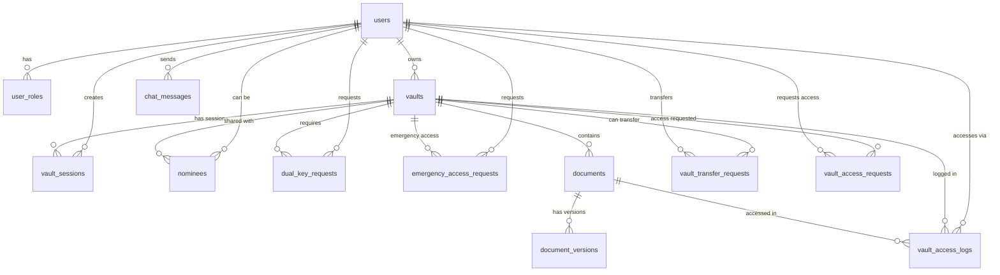

# Database Schema Documentation

> Comprehensive database schema documentation with ER diagram

---

## Overview

Khandoba Secure Docs uses **PostgreSQL** via Supabase as the shared backend database. All platforms (iOS, Android, Windows) connect to the same database with Row-Level Security (RLS) policies ensuring data isolation.

---

## Entity-Relationship Diagram



---

## Tables

### Core Tables

#### 1. users

User accounts across all platforms.

| Column | Type | Description |
|--------|------|-------------|
| `id` | UUID | Primary key |
| `apple_user_id` | TEXT | Apple user identifier (unique) |
| `full_name` | TEXT | User's full name |
| `email` | TEXT | Email address (nullable) |
| `profile_picture_url` | TEXT | Profile picture URL (nullable) |
| `created_at` | TIMESTAMPTZ | Account creation timestamp |
| `last_active_at` | TIMESTAMPTZ | Last active timestamp |
| `updated_at` | TIMESTAMPTZ | Last update timestamp |
| `is_active` | BOOLEAN | Active status |
| `is_premium_subscriber` | BOOLEAN | Premium subscription status |
| `subscription_expiry_date` | TIMESTAMPTZ | Subscription expiry (nullable) |

**Indexes:**
- `idx_users_apple_user_id` - On `apple_user_id`
- `idx_users_email` - On `email` (partial, where not null)
- `idx_users_is_active` - On `is_active`

**Note:** For Android, `google_user_id` is stored; for Windows, `microsoft_user_id`. The schema uses `apple_user_id` as the primary field, but can accommodate other providers.

#### 2. user_roles

User role assignments (deprecated - autopilot mode, no admin role).

| Column | Type | Description |
|--------|------|-------------|
| `id` | UUID | Primary key |
| `user_id` | UUID | Foreign key to users |
| `role_raw_value` | TEXT | Role value (default: 'client') |
| `assigned_at` | TIMESTAMPTZ | Assignment timestamp |
| `is_active` | BOOLEAN | Active status |
| `created_at` | TIMESTAMPTZ | Creation timestamp |

**Indexes:**
- `idx_user_roles_user_id` - On `user_id`
- `idx_user_roles_is_active` - On `is_active`

#### 3. vaults

Vault definitions - core security containers.

| Column | Type | Description |
|--------|------|-------------|
| `id` | UUID | Primary key |
| `name` | TEXT | Vault name |
| `vault_description` | TEXT | Description (nullable) |
| `owner_id` | UUID | Foreign key to users (owner) |
| `created_at` | TIMESTAMPTZ | Creation timestamp |
| `last_accessed_at` | TIMESTAMPTZ | Last access timestamp (nullable) |
| `status` | TEXT | Status: 'active', 'locked', 'archived' |
| `key_type` | TEXT | 'single' or 'dual' |
| `vault_type` | TEXT | 'source', 'sink', or 'both' |
| `is_system_vault` | BOOLEAN | System vault flag (read-only) |
| `encryption_key_data` | BYTEA | Encrypted key data (nullable) |
| `is_encrypted` | BOOLEAN | Encryption flag |
| `is_zero_knowledge` | BOOLEAN | Zero-knowledge flag |
| `relationship_officer_id` | UUID | Relationship officer (nullable) |
| `updated_at` | TIMESTAMPTZ | Last update timestamp |

**Indexes:**
- `idx_vaults_owner_id` - On `owner_id`
- `idx_vaults_status` - On `status`
- `idx_vaults_key_type` - On `key_type`
- `idx_vaults_is_system_vault` - On `is_system_vault`
- `idx_vaults_created_at` - On `created_at`

**Additional Columns** (from migrations):
- `is_anti_vault` - Anti-vault flag
- `monitored_vault_id` - Monitored vault reference
- `anti_vault_id` - Anti-vault reference

#### 4. documents

Document metadata and information.

| Column | Type | Description |
|--------|------|-------------|
| `id` | UUID | Primary key |
| `vault_id` | UUID | Foreign key to vaults |
| `name` | TEXT | Document name |
| `file_extension` | TEXT | File extension (nullable) |
| `mime_type` | TEXT | MIME type (nullable) |
| `file_size` | BIGINT | File size in bytes |
| `storage_path` | TEXT | Path in Supabase Storage (nullable) |
| `created_at` | TIMESTAMPTZ | Creation timestamp |
| `uploaded_at` | TIMESTAMPTZ | Upload timestamp |
| `last_modified_at` | TIMESTAMPTZ | Last modification (nullable) |
| `encryption_key_data` | BYTEA | Document encryption key (nullable) |
| `is_encrypted` | BOOLEAN | Encryption flag |
| `document_type` | TEXT | Type: 'image', 'pdf', 'video', 'audio', 'text', 'other' |
| `source_sink_type` | TEXT | 'source', 'sink', or 'both' |
| `is_archived` | BOOLEAN | Archive flag |
| `is_redacted` | BOOLEAN | Redaction flag |
| `status` | TEXT | Status: 'active', 'archived', 'deleted' |
| `extracted_text` | TEXT | Extracted text content (nullable) |
| `ai_tags` | TEXT[] | AI-generated tags array |
| `file_hash` | TEXT | File hash (nullable) |
| `metadata` | JSONB | Flexible JSON metadata (nullable) |
| `author` | TEXT | Document author (nullable) |
| `camera_info` | TEXT | Camera information (nullable) |
| `device_id` | TEXT | Device identifier (nullable) |
| `uploaded_by_user_id` | UUID | Uploader user ID (nullable) |
| `updated_at` | TIMESTAMPTZ | Last update timestamp |

**Indexes:**
- `idx_documents_vault_id` - On `vault_id`
- `idx_documents_status` - On `status`
- `idx_documents_document_type` - On `document_type`
- `idx_documents_created_at` - On `created_at`
- `idx_documents_ai_tags` - GIN index on `ai_tags` array
- `idx_documents_metadata` - GIN index on `metadata` JSONB

#### 5. document_versions

Document version history.

| Column | Type | Description |
|--------|------|-------------|
| `id` | UUID | Primary key |
| `document_id` | UUID | Foreign key to documents |
| `version_number` | INTEGER | Version number |
| `created_at` | TIMESTAMPTZ | Version creation timestamp |
| `file_size` | BIGINT | File size |
| `storage_path` | TEXT | Storage path (nullable) |
| `changes` | TEXT | Change description (nullable) |
| `updated_at` | TIMESTAMPTZ | Last update timestamp |

**Indexes:**
- `idx_document_versions_document_id` - On `document_id`
- `idx_document_versions_version_number` - On `version_number`

### Relationship Tables

#### 6. nominees

Vault sharing - users granted access to vaults.

| Column | Type | Description |
|--------|------|-------------|
| `id` | UUID | Primary key |
| `vault_id` | UUID | Foreign key to vaults |
| `user_id` | UUID | Foreign key to users (nominee) |
| `invited_by_user_id` | UUID | Inviter user ID (nullable) |
| `status` | TEXT | Status: 'pending', 'accepted', 'declined', 'revoked' |
| `invited_at` | TIMESTAMPTZ | Invitation timestamp |
| `accepted_at` | TIMESTAMPTZ | Acceptance timestamp (nullable) |
| `declined_at` | TIMESTAMPTZ | Decline timestamp (nullable) |
| `created_at` | TIMESTAMPTZ | Creation timestamp |
| `updated_at` | TIMESTAMPTZ | Last update timestamp |

**Additional Columns** (from migrations):
- Nominee-specific fields for subset nomination

#### 7. vault_sessions

Active vault sessions - tracks unlocked vaults.

| Column | Type | Description |
|--------|------|-------------|
| `id` | UUID | Primary key |
| `vault_id` | UUID | Foreign key to vaults |
| `user_id` | UUID | Foreign key to users |
| `started_at` | TIMESTAMPTZ | Session start timestamp |
| `expires_at` | TIMESTAMPTZ | Session expiry timestamp |
| `is_active` | BOOLEAN | Active status |
| `was_extended` | BOOLEAN | Extension flag |
| `created_at` | TIMESTAMPTZ | Creation timestamp |
| `updated_at` | TIMESTAMPTZ | Last update timestamp |

#### 8. vault_access_logs

Complete audit trail of vault access.

| Column | Type | Description |
|--------|------|-------------|
| `id` | UUID | Primary key |
| `vault_id` | UUID | Foreign key to vaults |
| `timestamp` | TIMESTAMPTZ | Access timestamp |
| `access_type` | TEXT | Type: 'opened', 'closed', 'viewed', 'modified', 'deleted' |
| `user_id` | UUID | User ID (nullable) |
| `user_name` | TEXT | User name (nullable) |
| `device_info` | TEXT | Device information (nullable) |
| `location_latitude` | DOUBLE | Latitude (nullable) |
| `location_longitude` | DOUBLE | Longitude (nullable) |
| `ip_address` | TEXT | IP address (nullable) |
| `document_id` | UUID | Document ID if applicable (nullable) |
| `document_name` | TEXT | Document name if applicable (nullable) |
| `created_at` | TIMESTAMPTZ | Creation timestamp |

### Request Tables

#### 9. dual_key_requests

Dual-key vault access requests.

| Column | Type | Description |
|--------|------|-------------|
| `id` | UUID | Primary key |
| `vault_id` | UUID | Foreign key to vaults |
| `requester_id` | UUID | Foreign key to users (requester) |
| `requested_at` | TIMESTAMPTZ | Request timestamp |
| `status` | TEXT | Status: 'pending', 'approved', 'denied' |
| `reason` | TEXT | Request reason (nullable) |
| `approved_at` | TIMESTAMPTZ | Approval timestamp (nullable) |
| `denied_at` | TIMESTAMPTZ | Denial timestamp (nullable) |
| `approver_id` | UUID | Approver user ID (nullable) |
| `ml_score` | DOUBLE | ML risk score (nullable) |
| `logical_reasoning` | TEXT | ML reasoning (nullable) |
| `decision_method` | TEXT | 'ml_auto' or 'manual' |
| `created_at` | TIMESTAMPTZ | Creation timestamp |
| `updated_at` | TIMESTAMPTZ | Last update timestamp |

#### 10. emergency_access_requests

Emergency access requests.

| Column | Type | Description |
|--------|------|-------------|
| `id` | UUID | Primary key |
| `vault_id` | UUID | Foreign key to vaults |
| `requester_id` | UUID | Foreign key to users |
| `reason` | TEXT | Emergency reason |
| `status` | TEXT | Status: 'pending', 'approved', 'denied' |
| `approved_at` | TIMESTAMPTZ | Approval timestamp (nullable) |
| `expires_at` | TIMESTAMPTZ | Expiry timestamp |
| `created_at` | TIMESTAMPTZ | Creation timestamp |
| `updated_at` | TIMESTAMPTZ | Last update timestamp |

#### 11. vault_transfer_requests

Vault ownership transfer requests.

| Column | Type | Description |
|--------|------|-------------|
| `id` | UUID | Primary key |
| `vault_id` | UUID | Foreign key to vaults |
| `from_user_id` | UUID | Current owner |
| `to_user_id` | UUID | New owner |
| `status` | TEXT | Status: 'pending', 'approved', 'denied' |
| `requested_at` | TIMESTAMPTZ | Request timestamp |
| `created_at` | TIMESTAMPTZ | Creation timestamp |
| `updated_at` | TIMESTAMPTZ | Last update timestamp |

#### 12. vault_access_requests

General vault access requests.

| Column | Type | Description |
|--------|------|-------------|
| `id` | UUID | Primary key |
| `vault_id` | UUID | Foreign key to vaults |
| `requester_id` | UUID | Foreign key to users |
| `status` | TEXT | Status |
| `requested_at` | TIMESTAMPTZ | Request timestamp |
| `created_at` | TIMESTAMPTZ | Creation timestamp |
| `updated_at` | TIMESTAMPTZ | Last update timestamp |

#### 13. chat_messages

User messaging system.

| Column | Type | Description |
|--------|------|-------------|
| `id` | UUID | Primary key |
| `sender_id` | UUID | Foreign key to users (sender) |
| `receiver_id` | UUID | Foreign key to users (receiver, nullable) |
| `vault_id` | UUID | Foreign key to vaults (nullable) |
| `message_text` | TEXT | Message content |
| `is_read` | BOOLEAN | Read status |
| `created_at` | TIMESTAMPTZ | Creation timestamp |

---

## Relationships

### Primary Relationships

1. **users → vaults** (one-to-many)
   - User owns multiple vaults
   - Foreign key: `vaults.owner_id → users.id`

2. **vaults → documents** (one-to-many)
   - Vault contains multiple documents
   - Foreign key: `documents.vault_id → vaults.id`
   - Cascade delete: Deleting vault deletes all documents

3. **documents → document_versions** (one-to-many)
   - Document has multiple versions
   - Foreign key: `document_versions.document_id → documents.id`
   - Cascade delete: Deleting document deletes all versions

4. **vaults → nominees** (one-to-many)
   - Vault shared with multiple nominees
   - Foreign key: `nominees.vault_id → vaults.id`
   - Cascade delete: Deleting vault removes all nominees

5. **users → nominees** (one-to-many)
   - User can be nominee for multiple vaults
   - Foreign key: `nominees.user_id → users.id`
   - Cascade delete: Deleting user removes nominee records

6. **vaults → vault_sessions** (one-to-many)
   - Vault can have multiple sessions (different users)
   - Foreign key: `vault_sessions.vault_id → vaults.id`

7. **vaults → vault_access_logs** (one-to-many)
   - Vault has multiple access log entries
   - Foreign key: `vault_access_logs.vault_id → vaults.id`

---

## Indexes

### Performance Indexes

**Users:**
- `apple_user_id` (unique) - Fast user lookup
- `email` (partial) - Email lookups
- `is_active` - Filter active users

**Vaults:**
- `owner_id` - Fast vault listing per user
- `status` - Filter by status
- `key_type` - Filter by key type
- `is_system_vault` - System vault queries

**Documents:**
- `vault_id` - Fast document listing per vault
- `status` - Filter by status
- `document_type` - Filter by type
- `ai_tags` (GIN) - Array search
- `metadata` (GIN) - JSONB search

**Access Logs:**
- `vault_id` - Log queries per vault
- `user_id` - User activity queries
- `timestamp` - Time-based queries

---

## Row-Level Security (RLS)

### Principles

1. Users can only access their own data
2. Vault owners control vault access
3. Nominees have limited access to shared vaults
4. System vaults are read-only for users

### RLS Policies

See `database/SUPABASE_RLS_POLICIES.md` for detailed RLS policy documentation.

**Key Policies:**
- Users can SELECT their own user record
- Users can SELECT vaults they own or are nominees for
- Users can SELECT documents in accessible vaults
- Users can INSERT/UPDATE/DELETE only their own data
- Audit logs are readable by vault owners

---

## Data Types

### UUIDs
- All primary keys use UUIDs
- Generated with `gen_random_uuid()` or `uuid-ossp` extension

### Timestamps
- All timestamps use `TIMESTAMPTZ` (timezone-aware)
- Default to `NOW()` for creation timestamps

### Arrays
- `ai_tags` uses `TEXT[]` for tag arrays
- Indexed with GIN index for fast searches

### JSON
- `metadata` uses `JSONB` for flexible metadata
- Indexed with GIN index for fast queries

### Binary Data
- `encryption_key_data` uses `BYTEA` for binary key data

---

## Storage Integration

### Supabase Storage Buckets

Documents are stored in Supabase Storage, not in database:
- `storage_path` field points to Storage bucket path
- Format: `{vaultId}/{documentId}.{extension}`
- Files encrypted before upload
- Metadata stored in database

---

## Migration Notes

### From SwiftData/CloudKit

- UUIDs maintained across migration
- Timestamps preserved
- Relationships maintained via foreign keys
- Additional fields added for cross-platform support

### Schema Evolution

- Migrations in `database/` directory
- Version-controlled schema changes
- Backward-compatible where possible

---

## Query Examples

### Get User's Vaults
```sql
SELECT * FROM vaults 
WHERE owner_id = $1 
ORDER BY created_at DESC;
```

### Get Vault Documents
```sql
SELECT * FROM documents 
WHERE vault_id = $1 
  AND status = 'active'
ORDER BY created_at DESC;
```

### Get Access Logs for Vault
```sql
SELECT * FROM vault_access_logs 
WHERE vault_id = $1 
ORDER BY timestamp DESC 
LIMIT 100;
```

### Search Documents by Tag
```sql
SELECT * FROM documents 
WHERE $1 = ANY(ai_tags) 
  AND status = 'active';
```

---

**Last Updated:** December 2024  
**Schema Version:** 1.0
